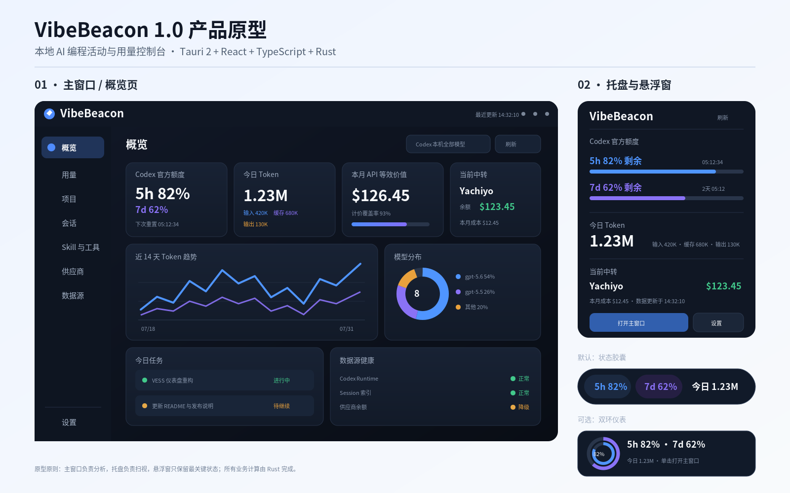

# VibeBeacon 1.0 完整重构方案

> **产品名称：** VibeBeacon  
> **中文定位：** 本地 AI 编程活动与用量控制台  
> **目标技术栈：** Tauri 2 + React 19 + TypeScript + Rust  
> **1.0 首发平台：** Windows 10/11 x64  
> **文档用途：** 直接交给 Codex 执行的重写总蓝图，明确做什么、保留什么、放弃什么、如何分阶段实施以及每阶段的验收门槛。  
> **旧版基线：** `CiaoBye/codexUU`，PySide6 预览版 `0.3.16`，仅作为行为参考与数据口径对照。



---

# 0. 给 Codex 的总执行指令

## 0.1 总任务

将现有 CodexUU 完全重写为 **VibeBeacon**：一款稳定、轻量、本地优先、长期驻留 Windows 托盘的 AI 编程活动与用量控制台。

VibeBeacon 1.0 必须整合以下能力：

1. Codex 官方额度窗口、使用比例与真实重置时间。
2. 本地 Codex Token、模型、推理强度、会话、项目、任务、Skill 与工具调用分析。
3. CC Switch 当前 Codex 中转站的本机代理用量、请求、成本与余额。
4. Windows 系统托盘、全局快捷键、原生通知与桌面悬浮状态窗。
5. 清晰的数据源健康状态、诊断、导出、升级与旧版迁移机制。

本次重写：

- **不是**现有 Python 代码逐行翻译成 Rust。
- **不是**继续复刻 `codexU` 的界面。
- **不是**先做一个漂亮外壳，再把旧逻辑硬塞进去。
- **是**重新建立数据引擎、状态模型、窗口生命周期、信息架构与测试体系。

## 0.2 不可违反的架构规则

Codex 必须遵守以下硬约束：

- Rust 是业务逻辑、数据访问、索引、调度、凭据与系统集成的唯一事实源。
- React 不得直接读取 Codex 文件、CC Switch 文件、SQLite、API Key 或用户本地路径。
- 前端不得计算统计周期、项目状态、额度有效性、模型价格或数据新鲜度。
- 每个数据源必须独立失败。CC Switch 余额失败不能阻止 Codex Token 与额度更新。
- 应用必须为单实例运行。
- 主窗口、托盘弹窗、悬浮窗必须使用不同的 Tauri capability 权限范围。
- VibeBeacon 数据库不得保存 Prompt 正文、模型回复正文、工具参数、项目文件内容或原始凭据。
- 使用标准 Semantic Versioning，例如 `1.0.0-alpha.1`、`1.0.0-beta.1`、`1.0.0`。
- 旧版必须通过 Git 标签与归档分支保留，直到新版稳定发布。
- 1.0 重写期间不得接入 Claude、Gemini、OpenCode、Pi、Cursor 等新数据源。
- 1.0 只针对 Windows 完成产品化，不为 macOS/Linux 牺牲当前稳定性。
- 当前阶段验收未通过时，不得进入下一阶段。

## 0.3 完成定义

满足以下全部条件，才可以将重写标记为完成：

- 对保留指标，新旧版在批准的测试夹具上输出一致或经过明确批准的差异。
- Windows 安装包运行时不依赖 Python。
- 主窗口关闭后，后台服务与托盘仍正常运行。
- 显示、隐藏、最小化、重启、升级和退出不会产生僵尸进程或重复实例。
- 空状态、部分失败、陈旧数据、权限不足、日志损坏、Runtime 不可用都具备可见界面和测试覆盖。
- 在 Windows 100%、125%、150%、200% 显示缩放下使用真实数据测试。
- CI 能产出带版本号的安装包、校验文件、更新元数据与发布资产。

---

# 1. 产品命名与定位

## 1.1 新名称

**正式工作名：VibeBeacon**

含义：

- `Vibe`：代表 Vibe Coding、AI 辅助开发与多工具工作流。
- `Beacon`：代表常驻桌面的状态信标，持续告诉用户额度、用量、项目和数据源是否正常。

中文副标题统一使用：

> **本地 AI 编程活动与用量控制台**

## 1.2 命名落地规则

新版统一使用：

| 项目 | 新值 |
|---|---|
| 产品显示名 | `VibeBeacon` |
| 可执行文件 | `VibeBeacon.exe` |
| GitHub 仓库建议名 | `CiaoBye/VibeBeacon` |
| Tauri productName | `VibeBeacon` |
| Bundle Identifier | `io.github.ciaobye.vibebeacon` |
| 配置目录 | `%APPDATA%\VibeBeacon` |
| 数据目录 | `%LOCALAPPDATA%\VibeBeacon` |
| 日志目录 | `%LOCALAPPDATA%\VibeBeacon\logs` |
| 诊断包目录 | `%LOCALAPPDATA%\VibeBeacon\diagnostics` |

旧版 `.codexU` 仅用于一次性只读迁移，不作为新版内部目录继续使用。

## 1.3 新产品定义

VibeBeacon 用于回答：

- 当前 Codex 官方额度还剩多少？
- 5 小时、7 天或其他真实窗口何时重置？
- 今天、本周、本月、累计使用了多少 Token？
- 哪些模型、项目和会话消耗最多？
- 当前有哪些任务正在进行、待继续、定时或完成？
- 哪些 Skill 与工具被真实调用？
- 当前 CC Switch 使用哪个中转站？本机代理用量、成本和余额是多少？
- 当前数据是否可信、是否陈旧、哪个数据源失败？

## 1.4 产品差异化

VibeBeacon 不与 CodexBar 比拼供应商数量。

核心差异化是：

> **深度本地 Codex 分析 + Windows 常驻状态入口 + CC Switch 中转核算。**

优先级排序：

1. 数据准确。
2. 长期运行稳定。
3. 数据来源可解释。
4. Windows 使用顺手。
5. 视觉清晰。
6. 扩展能力。
7. 供应商数量。

---

# 2. 明确做什么、保留什么、放弃什么

# 2.1 1.0 必须保留的产品行为

## A. 官方额度

- 根据真实返回动态渲染额度窗口。
- 只显示确实存在的窗口。
- 保留服务端给出的真实重置时间。
- 支持“已用 / 剩余”显示口径。
- 不伪造占位百分比、空环或重置时间。
- 明确区分：可用、耗尽、陈旧、不可验证、错误。
- 低额度提醒在同一重置周期最多触发一次。

## B. Token 统计

- 今日、本周、本月、累计。
- 未缓存输入、缓存输入、输出拆分。
- 模型归因必须来自真实本地事件。
- 推理强度只在日志明确提供时展示。
- 未知模型保持“未计价”，不得套用相近模型价格。
- 展示 API 等效价值时必须同时展示计价覆盖率。
- “本周”固定按所选时区的周一 00:00 到周日 23:59。
- 所有统计明确标注为“本机记录”，不得冒充账号云端总量。

## C. 项目与会话

- 只统计仍存在的真实项目目录。
- 项目详情包含模型拆分、Session 列表、最近活跃与统计周期。
- 支持 JSON、CSV、Markdown 导出。
- 导出内容不得包含 Prompt、回复正文、工具参数或项目文件正文。
- 今日任务按 Runtime + 项目聚合，不能把同一项目的多个会话当成多个任务。
- 状态优先级：进行中 → 待继续 → 定时 → 完成。
- 完成必须来自明确归档或完成证据，不能因为模型停止输出就判定完成。

## D. Skill 与工具

- 仅统计明确 Skill 加载事件。
- 仅统计明确 `function_call`、`custom_tool_call` 或对应 Runtime 显式工具事件。
- 不从普通文本提及推断使用。
- 不按调用次数把总 Token 或金额强行分摊给工具。

## E. CC Switch

- 读取当前 Codex 供应商。
- 以只读方式读取代理日志与日汇总。
- 展示供应商名、请求数、成功/失败、Token、代理成本。
- 通过受限声明式请求定义查询供应商余额。
- 中转余额和成本必须与官方 Codex 额度、API 等效价值分开。

## F. Windows 能力

- 系统托盘。
- 全局快捷键。
- 主窗口置顶。
- 关闭到托盘。
- 开机自启。
- 原生通知。
- 桌面悬浮状态窗。
- 更新检查与用户确认安装。
- 数据源诊断。

# 2.2 必须完全重写的模块

以下模块必须从零实现，不复制旧版结构：

- Codex app-server 监督器。
- JSONL 增量解析器。
- 本地 SQLite 索引。
- 周期统计与聚合器。
- 项目、会话和任务推导。
- 模型价格层。
- CC Switch 数据库读取器。
- CC Switch 余额请求解析器。
- 调度器与刷新模型。
- 数据源健康状态。
- 设置存储。
- 托盘管理。
- 全局快捷键。
- 窗口生命周期。
- 悬浮窗。
- 自动更新。
- 导出管线。
- 所有 UI 与设计系统。

旧版 Python 代码仅可用于：

- 理解数据来源。
- 提取测试夹具。
- 对比口径。
- 验证迁移数据。

不得把 Python 模块长期保留为运行依赖。

# 2.3 明确放弃的内容

## A. 放弃旧架构

- PySide6。
- Python 打包运行时。
- Python sidecar 作为最终后端。
- `DashboardWidget` 同时管理业务与 UI。
- 一次刷新全成或全败。
- 每 60 秒扫描全部数据。
- UI 内计算业务口径。
- 前端直接读文件或数据库。
- 超大 QSS 字符串设计系统。
- 分散在多个文件中的 `ctypes` Win32 修补。

## B. 放弃旧 UI 约束

- “CodexUU 是 codexU Windows 移植版”的定位。
- 固定 `1060×720` 最小窗口。
- 强制锁定宽高比。
- 只依赖四个大 Tab 的单页布局。
- 顶栏长期放置主题三按钮和语言切换。
- 含义不清晰的“中转 / GPT / 全部”切换。
- 五套悬浮窗同时作为一等功能长期维护。
- 概览页堆满全部指标。
- 把“羊毛进度”作为核心产品名称或主指标。
- 持续循环的装饰动画。
- 为截图固定所有卡片尺寸。

## C. 放弃不安全数据行为

- 执行任意 CC Switch JavaScript。
- 未经授权向跨域地址发送余额请求。
- 记录完整 URL 参数、认证头、API Key、原始供应商响应。
- 长期保存未脱敏 rollout 原始事件。
- 仅凭文件修改时间判断数据权威性。
- 用静默降级让不可靠数据看起来可信。

## D. 放弃旧开发流程

- `0.1.01` 之类自定义版本规则。
- 手动同步多个版本文件。
- 功能开发完成即自动发布 Release。
- 只用截图验收。
- Codex 与 CC Switch 尚未稳定时扩展更多供应商。

# 2.4 1.0 延后内容

以下不删除，但明确延后：

- Claude Code。
- Gemini CLI。
- OpenCode / OpenCode Go。
- Pi。
- Cursor、Windsurf、Zed。
- 多账号管理。
- 云端同步。
- 团队与组织面板。
- 插件市场。
- macOS/Linux 正式发行。
- 手机端。
- Web 控制台。
- 自动化成本优化建议。
- AI 自动总结项目表现。

---

# 3. 目标技术栈

## 3.1 桌面外壳与 Rust 后端

- Tauri 2。
- Rust stable，并通过 `rust-toolchain.toml` 固定。
- Tokio：异步任务。
- Serde / `serde_json`：数据序列化。
- `rusqlite`：本地 SQLite。
- `notify`：受限文件监听。
- `reqwest` + Rustls：网络请求。
- `tracing` / `tracing-subscriber`：结构化日志。
- `thiserror`：类型化错误。
- `time` 或 `chrono`：时区安全日期时间。
- `tokio-util::sync::CancellationToken`：退出取消。
- Tauri plugins：single-instance、global-shortcut、notification、store、window-state、updater、opener。

## 3.2 前端

- React 19。
- TypeScript strict。
- Vite。
- Tailwind CSS 4。
- CSS Variables 作为 Design Token 唯一来源。
- Radix UI primitives，仅用于降低可访问性风险。
- Zustand，仅存储交互状态，不复制完整业务状态。
- TanStack Query，仅用于分页命令查询与失效控制。
- ECharts：趋势、热力图、模型堆叠。
- TanStack Table：项目、Session 长列表。
- i18next：中英文。
- Vitest + Testing Library。
- Playwright：窗口页面与交互测试。

## 3.3 类型契约

Rust 领域结构必须自动生成 TypeScript 类型，建议使用：

- `specta` / `tauri-specta`，或
- `ts-rs`。

不得由开发者分别手写 Rust 与 TypeScript 同名接口。

## 3.4 依赖原则

新增依赖必须满足：

1. 有明确能力缺口。
2. 维护状态正常。
3. 许可证兼容。
4. 不引入不必要运行时。
5. 不为了一个简单函数引入大型依赖。
6. 安全相关依赖固定版本并进入依赖审计。

---

# 4. 仓库与分支策略

## 4.1 建议分支

- `main`：旧版稳定维护，直到新版 Beta 可用。
- `legacy/pyside6-0.3`：冻结旧版完整历史。
- `rewrite/tauri`：新版重写主分支。

旧版打标签：

```text
legacy-v0.3.16
```

新版起始版本：

```text
1.0.0-alpha.1
```

## 4.2 建议目录

```text
VibeBeacon/
├─ apps/
│  └─ desktop/
│     ├─ src-tauri/
│     │  ├─ src/
│     │  │  ├─ main.rs
│     │  │  ├─ app.rs
│     │  │  ├─ commands/
│     │  │  ├─ events/
│     │  │  ├─ windows/
│     │  │  └─ capabilities/
│     │  ├─ tauri.conf.json
│     │  └─ capabilities/
│     └─ frontend/
│        ├─ src/
│        │  ├─ app/
│        │  ├─ components/
│        │  ├─ design-system/
│        │  ├─ features/
│        │  │  ├─ overview/
│        │  │  ├─ usage/
│        │  │  ├─ projects/
│        │  │  ├─ sessions/
│        │  │  ├─ skills-tools/
│        │  │  ├─ providers/
│        │  │  ├─ sources/
│        │  │  └─ settings/
│        │  ├─ windows/
│        │  │  ├─ main/
│        │  │  ├─ tray-popup/
│        │  │  └─ floating-widget/
│        │  └─ generated/
│        └─ tests/
├─ crates/
│  ├─ vibebeacon-core/
│  ├─ vibebeacon-storage/
│  ├─ vibebeacon-scheduler/
│  ├─ vibebeacon-codex/
│  ├─ vibebeacon-ccswitch/
│  ├─ vibebeacon-export/
│  ├─ vibebeacon-diagnostics/
│  └─ vibebeacon-windows/
├─ fixtures/
│  ├─ codex/
│  ├─ ccswitch/
│  └─ expected/
├─ docs/
│  ├─ architecture/
│  ├─ data-contracts/
│  ├─ privacy/
│  ├─ migration/
│  └─ release/
├─ scripts/
├─ Cargo.toml
├─ package.json
├─ pnpm-workspace.yaml
├─ rust-toolchain.toml
├─ VERSION
├─ LICENSE
└─ THIRD_PARTY_NOTICES.md
```

## 4.3 旧代码处理

- 不把旧版直接搬进新版工作目录。
- 可在 `docs/legacy-reference.md` 中记录旧逻辑对应关系。
- 测试夹具必须脱敏，不提交真实 Prompt、路径和 API Key。
- 新版稳定后，旧版仅保留安全修复，不再增加功能。

---

# 5. 运行时架构

## 5.1 三层模型

```text
┌────────────────────────────────────────────────────┐
│ UI 层：React                                       │
│ 主窗口 / 托盘弹窗 / 桌面悬浮窗 / 设置窗口          │
└───────────────────────┬────────────────────────────┘
                        │ Tauri Commands / Events
┌───────────────────────▼────────────────────────────┐
│ 应用层：Rust                                        │
│ AppState / Scheduler / Provider Manager / Export   │
│ Snapshot / Query / Diagnostics / Window Lifecycle  │
└───────────────────────┬────────────────────────────┘
                        │
┌───────────────────────▼────────────────────────────┐
│ 数据层：本地                                        │
│ Codex app-server / Codex SQLite / JSONL / CC Switch│
│ VibeBeacon SQLite / Settings / Logs                 │
└────────────────────────────────────────────────────┘
```

## 5.2 进程模型

VibeBeacon 使用一个 Tauri 主进程：

```text
VibeBeacon.exe
├─ Rust 后台状态与任务
├─ 主窗口 WebView
├─ 托盘弹窗 WebView
└─ 桌面悬浮窗 WebView
```

不使用：

- Python 子进程。
- 常驻 Node 后端。
- 本地 HTTP 服务。
- Electron Chromium 运行时。

## 5.3 AppState

```rust
pub struct AppState {
    pub snapshot: Arc<RwLock<DashboardSnapshot>>,
    pub settings: Arc<RwLock<AppSettings>>,
    pub scheduler: SchedulerHandle,
    pub providers: ProviderRegistry,
    pub storage: Storage,
    pub diagnostics: DiagnosticsService,
    pub shutdown: CancellationToken,
}
```

要求：

- UI 关闭不销毁 AppState。
- 托盘仍可读取最后一个稳定快照。
- 所有后台任务在退出时接收 CancellationToken。
- 不允许后台任务持有无法结束的阻塞线程。

## 5.4 单实例

第二次启动时：

- 不创建第二个后台引擎。
- 唤醒已有主窗口。
- 可把命令行参数传给已有实例。
- 不重复注册快捷键。
- 不重复创建托盘图标。

## 5.5 窗口职责

### 主窗口

负责：

- 完整概览。
- 用量分析。
- 项目与会话。
- Skill 与工具。
- 供应商。
- 数据源状态。
- 设置。

不得：

- 直接访问文件。
- 自行刷新数据源。
- 保存敏感凭据。

### 托盘弹窗

只展示：

- 5h / 7d 或实际存在额度。
- 今日 Token。
- 当前中转站与余额摘要。
- 最近更新时间。
- 打开主窗口、刷新、设置、退出。

### 悬浮窗

1.0 只保留两种形态：

1. **状态胶囊**：默认。
2. **双环仪表**：可选。

放弃五套样式同时维护。

---

# 6. 领域模型与前后端数据契约

## 6.1 数据源健康状态

```rust
pub enum SourceHealth {
    Available,
    Degraded,
    Stale,
    Unavailable,
}
```

每个数据源必须提供：

```rust
pub struct SourceStatus {
    pub id: String,
    pub name: String,
    pub health: SourceHealth,
    pub last_attempt_at: Option<OffsetDateTime>,
    pub last_success_at: Option<OffsetDateTime>,
    pub data_timestamp: Option<OffsetDateTime>,
    pub error_code: Option<String>,
    pub user_message: Option<String>,
    pub retrying: bool,
}
```

## 6.2 总快照

```rust
pub struct DashboardSnapshot {
    pub revision: u64,
    pub generated_at: OffsetDateTime,
    pub statistics_timezone: String,
    pub sources: Vec<SourceStatus>,
    pub quota: QuotaSnapshot,
    pub token_periods: TokenPeriods,
    pub models: Vec<ModelUsage>,
    pub project_summary: ProjectSummary,
    pub task_summary: TaskSummary,
    pub skills_summary: SkillSummary,
    pub tools_summary: ToolSummary,
    pub relay: Option<RelaySnapshot>,
}
```

要求：

- `revision` 每次有效状态变化递增。
- 前端收到旧 revision 时忽略。
- 快照只包含首屏与常用摘要。
- 大列表通过分页 Query 获取。

## 6.3 额度模型

```rust
pub struct QuotaWindow {
    pub id: String,
    pub label: String,
    pub used_percent: Option<f64>,
    pub remaining_percent: Option<f64>,
    pub reset_at: Option<OffsetDateTime>,
    pub window_minutes: Option<u64>,
    pub state: QuotaState,
    pub source: String,
}
```

规则：

- 不根据位置猜测 5h 或 7d。
- 优先根据协议字段和窗口时长识别。
- 不存在的窗口不进入数组。
- `reset_at` 缺失时不自行推算。

## 6.4 Token 周期

```rust
pub struct TokenBreakdown {
    pub uncached_input: u64,
    pub cached_input: u64,
    pub output: u64,
}

pub struct TokenPeriodValue {
    pub tokens: TokenBreakdown,
    pub api_equivalent_usd: Option<f64>,
    pub pricing_coverage_percent: f64,
    pub unpriced_tokens: u64,
}

pub struct TokenPeriods {
    pub today: TokenPeriodValue,
    pub week: TokenPeriodValue,
    pub month: TokenPeriodValue,
    pub all_time: TokenPeriodValue,
}
```

## 6.5 模型使用

每个模型包含：

- 真实模型 ID。
- 显示名。
- Token 拆分。
- Session 数。
- Turn 数。
- 日期趋势。
- 推理强度拆分。
- 是否精确匹配价格。
- API 等效价值。

价格规则：

- 仅精确模型 ID 匹配。
- 未知模型不计价。
- 网关别名不推测。
- 价格数据必须带来源版本与更新时间。

## 6.6 项目与会话

项目字段：

- 项目 ID。
- 展示名。
- 脱敏路径标识。
- 真实路径仅后端持有。
- Token。
- Session 数。
- 模型分布。
- 最近活跃时间。
- 当前统计范围。

Session 字段：

- Session ID。
- 标题或安全摘要。
- 项目 ID。
- 模型。
- Token。
- 开始时间。
- 最后活动时间。
- 状态。
- 是否归档。

默认前端不得拿到完整绝对路径；只有用户执行“打开文件夹”时，由后端按项目 ID 解析并打开。

## 6.7 任务状态

```rust
pub enum TaskState {
    Running,
    Pending,
    Scheduled,
    Completed,
}
```

判定优先级固定：

```text
Running > Pending > Scheduled > Completed
```

## 6.8 中转供应商

```rust
pub struct RelaySnapshot {
    pub provider_id: String,
    pub provider_name: String,
    pub plan_name: Option<String>,
    pub balance: Option<MoneyBalance>,
    pub today_tokens: TokenBreakdown,
    pub month_tokens: TokenBreakdown,
    pub request_count: u64,
    pub success_count: u64,
    pub failure_count: u64,
    pub month_cost_usd: f64,
    pub source_status: SourceStatus,
}
```

---

# 7. 本地索引设计

## 7.1 存储路径

```text
%LOCALAPPDATA%\VibeBeacon\data\vibebeacon.db
%APPDATA%\VibeBeacon\config.json
%LOCALAPPDATA%\VibeBeacon\logs\
%LOCALAPPDATA%\VibeBeacon\diagnostics\
```

## 7.2 SQLite 规则

- WAL 模式。
- 启动时执行 schema migration。
- 每次 migration 可回滚或明确失败。
- 原始 Codex / CC Switch 数据源只读。
- VibeBeacon 自有数据库可重建。
- 派生索引损坏时允许备份后重建。

## 7.3 建议数据表

```text
schema_migrations
source_files
sessions
session_usage_events
model_usage_daily
projects
project_daily
skills_daily
tools_daily
tasks
provider_usage_daily
provider_requests_daily
pricing_catalog
app_events
```

## 7.4 增量游标

每个源文件记录：

- 规范化路径 Hash。
- 文件大小。
- 修改时间。
- 已解析字节位置。
- 最近事件时间。
- 内容指纹。
- Parser schema 版本。

文件仅追加时，从上次字节位置继续解析。

文件被截断、替换或 schema 变化时：

- 标记旧索引失效。
- 仅重建该文件相关数据。
- 不重建整个数据库。

## 7.5 隐私过滤

解析过程中只保留批准字段：

- ID。
- 时间。
- Token。
- 模型。
- 推理强度。
- 工具名。
- Skill 名。
- 项目标识。
- 状态。

立即丢弃：

- Prompt。
- 回复正文。
- 工具参数。
- 文件 diff。
- 项目文件内容。
- 环境变量。
- 凭据。

---

# 8. Provider 架构

## 8.1 Provider Trait

```rust
#[async_trait]
pub trait UsageProvider: Send + Sync {
    fn id(&self) -> ProviderId;
    fn display_name(&self) -> &'static str;

    async fn discover(
        &self,
        context: &DiscoveryContext,
    ) -> Result<DiscoveryResult, ProviderError>;

    async fn refresh(
        &self,
        context: &RefreshContext,
    ) -> Result<ProviderSnapshot, ProviderError>;

    async fn health(&self) -> SourceStatus;
}
```

## 8.2 1.0 只实现两个 Provider

- `CodexProvider`
- `CCSwitchProvider`

Provider Registry 可以扩展，但不得在 1.0 接入其他产品。

## 8.3 CodexProvider 职责

- 探测 Codex Home。
- 探测根目录与 `.codex/sqlite/` 布局。
- 监督 app-server。
- 读取官方额度。
- 索引 sessions 与 archived sessions。
- 读取线程索引。
- 读取 automations。
- 生成项目、会话、任务、模型、Skill、工具摘要。
- 输出独立 SourceStatus。

## 8.4 CC Switch Provider 职责

- 探测 `~/.cc-switch`。
- 只读打开 `cc-switch.db`。
- 识别当前 Codex Provider。
- 增量读取代理记录。
- 聚合请求、Token 与成本。
- 受限查询余额。
- 余额失败时保留本机代理统计。

## 8.5 声明式余额接口

不执行任意脚本，转换为内部结构：

```rust
pub struct BalanceEndpoint {
    pub method: HttpMethod,
    pub url_template: String,
    pub auth: AuthPlacement,
    pub response_paths: BalanceResponsePaths,
    pub timeout_seconds: u8,
    pub allow_cross_domain: bool,
}
```

安全要求：

- 默认只允许与供应商 Base URL 同域。
- 跨域必须用户明确授权。
- API Key 只存在 Rust 内存与安全存储。
- 禁止把认证信息发送给 React。
- 响应大小受限。
- 重定向次数受限。
- 超时最大 15 秒。
- 日志不记录秘密。

---

# 9. Codex app-server 监督器

## 9.1 状态机

```text
Stopped
  ↓
Starting
  ↓
Ready
  ↓
Disconnected / Timeout / Exited
  ↓
Backoff
  ↓
Starting
```

## 9.2 必须能力

- 单连接复用。
- 独立读写任务。
- 请求 ID 路由。
- 每个请求超时。
- stdout 单行大小限制。
- 进程意外退出检测。
- 自动重启。
- 指数退避与最大退避。
- 应用退出时取消和回收。
- 诊断页可见状态、可执行文件路径、最近错误与状态时间。

## 9.3 失败行为

- app-server 不可用时，仍可展示本地索引数据。
- 额度快照陈旧时明确标记时间。
- 不把旧额度伪装成实时。
- 不因额度失败阻止项目和 Token 更新。

---

# 10. 调度与刷新模型

## 10.1 独立任务

```text
quota_refresh
session_file_watch
session_index_catchup
project_aggregation
ccswitch_log_refresh
ccswitch_balance_refresh
update_check
log_rotation
```

## 10.2 默认频率

| 任务 | 默认策略 |
|---|---|
| 官方额度 | 60 秒；失败指数退避，最大 15 分钟 |
| Session 文件 | 文件监听；30 秒兜底 |
| 索引聚合 | 有新事件后防抖 1–2 秒 |
| CC Switch 日志 | 30 秒或数据库变更检测 |
| 余额 | 5 分钟；失败最大退避 30 分钟 |
| 更新检查 | 每 12 小时与手动触发 |
| 诊断日志轮转 | 启动时与每日一次 |

## 10.3 刷新范围

前端手动刷新可指定：

```rust
pub enum RefreshScope {
    All,
    Quota,
    Sessions,
    Relay,
    Balance,
}
```

## 10.4 并发规则

- 相同 Scope 不并发执行。
- 不同 Scope 可并发，但共享数据库写入必须串行事务。
- 新触发不会无限排队，只记录一次待执行。
- UI 显示每个 Source 的刷新状态，而不是全局唯一转圈。

---

# 11. Tauri Commands 与 Events

## 11.1 Commands

建议命令：

```text
get_dashboard_snapshot
refresh_sources
get_projects_page
get_project_detail
get_sessions_page
get_session_detail
get_model_usage
get_skills_tools
get_source_diagnostics
get_settings
save_settings
import_legacy_settings
export_project
export_usage
open_project_folder
show_main_window
hide_main_window
set_widget_visible
check_for_updates
install_update
create_diagnostic_bundle
```

## 11.2 Events

```text
snapshot://updated
source://status-changed
refresh://started
refresh://completed
refresh://failed
quota://threshold
update://available
settings://changed
```

## 11.3 错误封装

```rust
pub struct CommandError {
    pub code: String,
    pub message: String,
    pub recoverable: bool,
    pub source_id: Option<String>,
    pub details_id: Option<String>,
}
```

前端显示用户消息，不直接展示 Rust backtrace。

## 11.4 Snapshot 与 Query

- 总览使用 Snapshot。
- 项目、Session、模型详细数据使用分页 Query。
- 不把数万行会话一次性推给 WebView。
- 前端筛选参数传入后端，由 SQLite 查询执行。

---

# 12. 前端信息架构

## 12.1 主导航

使用 64px 左侧图标栏：

```text
概览
用量
项目
会话
Skill 与工具
供应商
数据源
设置
```

窗口宽度充足时可显示文字；窄窗口仅显示图标与 Tooltip。

## 12.2 顶栏

只保留：

- 当前页面标题。
- 统计时间范围或上下文筛选。
- 当前数据范围。
- 最近更新时间。
- 刷新。
- 设置入口。

主题、语言放入设置，不占用顶栏。

## 12.3 数据范围

不得继续使用含义模糊的三个按钮。

建议拆成两类：

### 统计数据范围

- `Codex 本机全部模型`
- `仅 GPT 模型`
- `当前 CC Switch 中转`

### 官方额度来源

始终单独展示 Codex 官方额度，不随模型范围变化。

UI 必须明确提示：

- 哪些卡片受范围影响。
- 哪些卡片不受影响。

## 12.4 概览页

首屏只回答最重要问题：

### 第一行

- 官方额度卡。
- 今日 Token。
- 本月 API 等效价值。
- 当前中转站余额/状态。

### 第二行

- 近 14 天 Token 趋势。
- 模型分布。
- 数据源健康摘要。

### 第三行

- 今日任务。
- 最近项目。

不在概览展示完整 Session 表、完整 Skill 榜和所有模型详情。

## 12.5 用量页

包含：

- 今日 / 本周 / 本月 / 累计 / 自定义范围。
- Token 趋势。
- 未缓存 / 缓存 / 输出。
- 模型堆叠趋势。
- API 等效价值。
- 计价覆盖率。
- 日历热力图。
- Token 与金额切换。

## 12.6 项目页

- 项目排行。
- Token、金额、会话数、最近活跃。
- 本周 / 本月 / 累计。
- 搜索、排序、筛选。
- 点击进入项目详情。

项目详情：

- 总览。
- 模型拆分。
- 时间趋势。
- Session 列表。
- 导出。
- 打开项目目录。

## 12.7 会话页

- 分页表格。
- 时间、项目、模型、Token、状态。
- 搜索标题与项目。
- 筛选模型、日期和状态。
- 不显示 Transcript 正文。

## 12.8 Skill 与工具页

分成两个视图：

- Skill 使用排行。
- 工具调用排行。

展示：

- 调用次数。
- 活跃日期。
- 最近调用。
- 关联项目数。

不得显示虚构 Token 分摊。

## 12.9 供应商页

1.0 只展示 CC Switch：

- 当前供应商。
- 套餐与余额。
- 代理请求。
- 成功率。
- Token。
- 本月成本。
- 最近余额查询状态。
- 只读数据来源说明。

## 12.10 数据源页

卡片展示：

```text
Codex Runtime
Codex SQLite
Session 日志
Automations
CC Switch SQLite
供应商余额接口
VibeBeacon 本地索引
GitHub 更新
```

每项包含：

- 健康状态。
- 最近成功。
- 数据时间。
- 最近错误。
- 重试。
- 诊断详情。

## 12.11 设置页

### 通用

- 语言。
- 统计时区。
- 开机自启。
- 关闭行为。
- 全局快捷键。

### 外观

- 自动 / 浅色 / 深色。
- 紧凑密度。
- 减少动态效果。

### 托盘与悬浮窗

- 托盘摘要内容。
- 悬浮窗显示/隐藏。
- 状态胶囊 / 双环仪表。
- 小 / 中 / 大。
- 位置重置。

### 通知

- 额度阈值。
- 数据源异常。
- 更新提醒。

### 隐私

- 本地数据说明。
- 诊断包包含项。
- 清除派生索引。
- 禁止清除原始 Codex 日志。

### 高级

- Codex Home 覆盖路径。
- CC Switch 路径覆盖。
- 余额跨域授权。
- 更新通道。
- 重建索引。

---

# 13. 窗口原型规范

## 13.1 主窗口

- 默认尺寸：`1280×820`。
- 最小尺寸：`960×640`。
- 不锁定宽高比。
- 支持最大化。
- 高 DPI 响应式布局。
- 低于 1100px 时，概览卡自动换行。
- 低于 1000px 时，左侧导航收敛为纯图标。

## 13.2 托盘弹窗

建议尺寸：`360×480`。

布局：

```text
VibeBeacon                       刷新

Codex 官方额度
5h  82% 剩余      05:12:34
7d  62% 剩余      2天 05:12

今日 Token
1.23M   输入 / 缓存 / 输出

当前中转
Yachiyo        余额 $123.45
本月成本       $12.45

数据更新于 14:32:10

[打开主窗口] [设置]
```

## 13.3 状态胶囊

默认形式：

```text
[ 5h 82% ]  [ 7d 62% ]  今日 1.23M
```

要求：

- 无冗余按钮。
- 可拖动。
- 右键菜单。
- 单击打开主窗口。
- 额度缺失时自动收敛。

## 13.4 双环仪表

- 外环 7d。
- 内环 5h。
- 缺失窗口退化为单环。
- 圆心显示当前口径百分比。
- 下方仅显示今日 Token。
- 不再维护其他三套旧样式。

---

# 14. 设计系统

## 14.1 视觉方向

关键词：

- Windows 工具感。
- 深色数据仪表盘。
- 克制科技感。
- 信息优先。
- 轻量材质。
- 不模仿 macOS Liquid Glass。
- 不做夸张赛博霓虹。

## 14.2 建议色彩

深色主题：

```css
--bg-app: #0B0F17;
--bg-elevated: #111827;
--bg-card: #151D2B;
--border-subtle: #263247;
--text-primary: #F5F7FB;
--text-secondary: #9EABC0;
--text-muted: #69778E;
--accent: #4F8CFF;
--accent-2: #826EF6;
--success: #42C98B;
--warning: #E7A948;
--danger: #F06473;
--token-uncached: #4F95FF;
--token-cached: #8A72F6;
--token-output: #E9A13C;
```

浅色主题对应降低饱和、提高边界与文字对比度。

## 14.3 字体

- Windows：Segoe UI Variable。
- 中文回退：Microsoft YaHei UI。
- 数字：Segoe UI Variable Display。
- 不打包第三方字体，除非许可证与体积明确批准。

## 14.4 间距

- 基础单位：4px。
- 卡片圆角：12px。
- 控件圆角：8px。
- 页面边距：20–24px。
- 卡片间距：12–16px。

## 14.5 动效

- 页面切换：150–200ms。
- 数值更新：不超过 250ms。
- 数据刷新不触发整页闪烁。
- 背景状态不运行持续动画。
- 开启“减少动态效果”后禁用非必要动画。

## 14.6 可访问性

- 键盘可操作。
- 焦点清晰。
- 不只依靠颜色表达状态。
- Tooltip 可读。
- 图表提供文字摘要。
- 125%–200% 缩放不裁切。

---

# 15. 设置、迁移与兼容

## 15.1 新设置格式

```json
{
  "schemaVersion": 1,
  "language": "zh-CN",
  "theme": "system",
  "statisticsTimezone": "system",
  "closeBehavior": "tray",
  "launchAtStartup": false,
  "globalShortcut": "Ctrl+U",
  "quotaDisplayMode": "remaining",
  "reduceMotion": false,
  "compactDensity": false,
  "widget": {
    "enabled": true,
    "style": "pill",
    "size": "medium"
  },
  "notifications": {
    "quotaThresholds": [20, 10, 5],
    "sourceFailures": true,
    "updates": true
  },
  "paths": {
    "codexHome": null,
    "ccSwitchHome": null
  },
  "updates": {
    "channel": "stable",
    "autoCheck": true
  }
}
```

## 15.2 旧版迁移

首次启动检测：

```text
%USERPROFILE%\.codexU\config.json
```

迁移规则：

- 只读。
- 显示可导入内容。
- 用户确认后写入新设置。
- 不修改旧文件。
- 不搬运旧派生数据库。
- 主题、语言、时区、快捷键、关闭行为、额度口径可迁移。
- 旧悬浮窗五套样式映射为状态胶囊或双环仪表。

## 15.3 配置版本迁移

每次 schema 变化必须：

- 提供显式 migration。
- 测试旧版本配置。
- 备份原配置。
- 失败时恢复默认并提示，不静默丢失。

---

# 16. 隐私与安全

## 16.1 本地优先承诺

默认行为：

- 数据解析在本机完成。
- 不上传 Prompt、回复、项目代码或路径。
- 不进行匿名遥测。
- 网络仅用于已启用余额查询和更新检查。

## 16.2 Tauri Capability

### 主窗口

允许：

- 读取聚合快照。
- 执行分页查询。
- 修改设置。
- 导出。

### 托盘弹窗

只允许：

- 读取摘要。
- 刷新。
- 打开窗口。
- 退出。

### 悬浮窗

只允许：

- 读取额度、今日 Token、主题。
- 打开主窗口。
- 保存位置。

## 16.3 CSP

- 禁止远程脚本。
- 禁止内联任意脚本。
- 图片默认仅本地资源与 data URI。
- 网络请求只由 Rust 发起。

## 16.4 凭据

- API Key 不进入前端。
- Windows 使用 DPAPI 或 Tauri 安全存储层。
- 日志脱敏。
- 诊断包不包含凭据。

## 16.5 诊断包

默认包含：

- 应用版本。
- Windows 版本。
- WebView2 版本。
- 数据源状态。
- 数据库 schema 版本。
- 脱敏日志。
- 配置结构但不包含密钥和完整路径。

生成前列出内容并让用户确认。

---

# 17. 测试策略

## 17.1 测试夹具矩阵

### 额度

- 正常双窗口。
- 只有 7d。
- 只有 5h。
- 额度耗尽。
- 无 reset 时间。
- Runtime 超时。
- 陈旧 session 快照。
- 未识别月度窗口。

### Session

- 新旧 Codex SQLite 路径。
- JSONL 正常追加。
- 文件被截断。
- 损坏行。
- 超大行。
- 未知事件类型。
- 未知模型。
- 推理强度缺失。
- 跨日、跨周、跨月。
- 夏令时与时区切换。

### 项目与任务

- 同项目多个线程。
- 活跃与归档同时存在。
- 已删除目录。
- 空目录。
- Temp / AppData / `.codex` 目录。
- 定时任务启用与禁用。

### CC Switch

- 数据库不存在。
- Provider 不存在。
- 当前 Provider 切换。
- 代理日志与 daily rollup 并存。
- 日志超过读取上限。
- 余额接口成功。
- 余额接口超时。
- 不可识别响应。
- 非同域接口未授权。
- API Key 脱敏。

## 17.2 新旧版口径对比

创建：

```text
fixtures/expected/legacy-snapshot.json
fixtures/expected/rust-snapshot.json
```

对比：

- Token 总数。
- 未缓存/缓存/输出。
- 模型拆分。
- 周期边界。
- 项目排序。
- Session 数量。
- 任务状态。
- Skill 与工具。
- API 等效价值。
- 额度窗口与重置时间。
- CC Switch 请求和成本。

差异必须写入 `docs/migration/known-differences.md` 并获得明确批准。

## 17.3 Rust 测试

- 单元测试。
- Parser property tests。
- SQLite migration tests。
- Provider 集成测试。
- Scheduler fake-time tests。
- app-server fake-process tests。
- Privacy filtering tests。
- Export snapshot tests。

## 17.4 前端测试

- 组件状态。
- 空/加载/错误/陈旧状态。
- 响应式布局。
- 主题对比度。
- 表格筛选。
- 图表摘要。
- 键盘导航。

## 17.5 打包后 Smoke Test

必须在真实安装包上验证：

- 首次启动。
- 单实例。
- 关闭到托盘。
- 托盘唤回。
- 快捷键。
- 开机自启。
- 悬浮窗位置。
- 多显示器拔插。
- 安装升级。
- 卸载。
- 应用退出后无后台残留。

---

# 18. 性能与可靠性预算

目标预算：

| 指标 | 目标 |
|---|---|
| 冷启动到托盘可用 | ≤ 2.5 秒 |
| 主窗口首屏 | ≤ 1.5 秒（有缓存） |
| 主窗口空闲内存 | ≤ 150 MB |
| 后台空闲 CPU | 平均 ≤ 1%，峰值可短时上升 |
| 数据更新到 UI | ≤ 300 ms（聚合完成后） |
| 托盘弹窗打开 | ≤ 150 ms |
| 普通查询 | ≤ 200 ms |
| 10 万 Session 记录分页 | 首屏 ≤ 500 ms |
| 应用正常退出 | ≤ 3 秒 |

可靠性要求：

- 后台任务 Panic 不得带崩整个应用。
- SQLite 锁冲突要重试并有上限。
- 文件监听丢事件时由兜底扫描修复。
- 网络失败不影响本地统计。
- WebView 重载不影响 Rust 后台。

---

# 19. 日志与诊断

## 19.1 结构化日志字段

- timestamp。
- level。
- target。
- source_id。
- operation。
- duration_ms。
- result。
- error_code。
- correlation_id。

禁止：

- Prompt。
- 回复。
- API Key。
- Authorization。
- 完整请求体。
- 未脱敏路径。

## 19.2 日志轮转

- 单文件 5–10 MB。
- 保留 7 天。
- 总大小上限 100 MB。
- 用户可从设置清理。

## 19.3 用户可见诊断

数据源页提供：

- 简明状态。
- 最近成功。
- 最近失败。
- 重试按钮。
- 复制安全摘要。
- 导出诊断包。

---

# 20. 导出

## 20.1 格式

- JSON。
- CSV。
- Markdown。

1.0 不必须提供 Excel；确认需求后再加入。

## 20.2 导出内容

允许：

- 统计范围。
- Token。
- 模型。
- 项目显示名。
- Session 安全摘要。
- 时间。
- Skill 与工具名。
- 数据来源与生成时间。

禁止：

- Prompt 正文。
- 回复正文。
- 工具参数。
- 文件正文。
- 密钥。
- 默认导出完整绝对路径。

---

# 21. 更新与发布

## 21.1 版本规则

使用标准 SemVer：

```text
1.0.0-alpha.1
1.0.0-alpha.2
1.0.0-beta.1
1.0.0-rc.1
1.0.0
```

根目录 `VERSION` 为唯一业务版本来源，构建时同步到 Cargo、package 与 Tauri 配置。

## 21.2 更新通道

- stable。
- beta。

Alpha 默认不向普通用户发布自动更新。

## 21.3 CI 检查

每个 PR：

- Rust fmt。
- Clippy。
- Cargo tests。
- TypeScript typecheck。
- ESLint。
- Vitest。
- 前端 build。
- Tauri compile check。
- 许可证与依赖审计。

## 21.4 发布工作流

Release 只能手动触发或由明确标签触发：

1. 校验版本。
2. 构建 Windows x64。
3. 运行打包 Smoke Test。
4. 生成安装包。
5. 生成 SHA-256。
6. 生成 updater metadata。
7. 签名。
8. 上传 Artifact。
9. 用户明确选择时发布 GitHub Release。

## 21.5 签名

- 正式稳定版前完成 Windows 代码签名。
- 更新器必须验证签名。
- 未签名 Beta 必须在发布说明中明确。

---

# 22. 分阶段实施路线与验收门槛

# 阶段 0：冻结与规范

## 做什么

- 创建旧版标签与归档分支。
- 创建 `rewrite/tauri`。
- 提取脱敏测试夹具。
- 定义领域数据契约。
- 确定隐私白名单。
- 新建 `LICENSE` 与 `THIRD_PARTY_NOTICES.md`。
- 替换产品名称与包名方案。

## 验收

- 旧版可独立构建。
- 夹具不含敏感正文。
- 关键数据口径有 expected JSON。
- 新版架构文档通过评审。

# 阶段 1：Tauri 桌面外壳

## 做什么

- 初始化 Tauri 2 + React 19 + TypeScript。
- 单实例。
- 主窗口。
- 托盘。
- 关闭到托盘。
- 全局快捷键。
- 设置存储。
- capability 分离。
- 基础日志。

## 验收

- Windows 安装后可运行。
- 无 Python。
- 多次启动只有一个实例。
- 主窗口可稳定显示/隐藏 100 次。
- 退出后无残留进程。

# 阶段 2：本地索引基础

## 做什么

- SQLite schema。
- migration。
- 增量文件游标。
- JSONL 流式解析框架。
- 隐私字段过滤。
- 文件监听与兜底扫描。

## 验收

- 增量追加不重复计数。
- 文件截断可恢复。
- 损坏行不阻断其他记录。
- 数据库可重建。
- 隐私测试通过。

# 阶段 3：Codex Provider

## 做什么

- Codex 路径发现。
- app-server 监督器。
- 官方额度。
- SQLite 线程索引。
- sessions / archived sessions。
- automations。
- Token、模型、项目、会话、任务、Skill、工具聚合。

## 验收

- 关键夹具与旧版口径一致。
- app-server 退出可自动恢复。
- 额度失败不影响本地分析。
- 真实本机数据运行 72 小时无崩溃。

# 阶段 4：CC Switch Provider

## 做什么

- 当前 Provider 识别。
- 代理日志增量读取。
- Daily rollup 去重策略。
- 请求、Token、成本聚合。
- 声明式余额查询。
- 同域与跨域授权。

## 验收

- 只读数据库。
- 余额失败不影响代理统计。
- 不泄露 API Key。
- 当前 Provider 切换后 30 秒内更新。

# 阶段 5：主产品 UI

## 做什么

- Design Token。
- 左侧导航。
- 概览。
- 用量。
- 项目。
- 会话。
- Skill 与工具。
- 供应商。
- 数据源。
- 设置。

## 验收

- 100%–200% 缩放无裁切。
- 960×640 可用。
- 所有页面有空、加载、错误、陈旧状态。
- 深浅主题可读。
- 前端无业务统计计算。

# 阶段 6：托盘与悬浮窗

## 做什么

- 托盘弹窗。
- 状态胶囊。
- 双环仪表。
- 位置持久化。
- 多显示器边界修正。
- 通知与阈值。

## 验收

- 主窗口关闭不影响托盘。
- 显示器变化后悬浮窗不会丢失。
- 缺失额度自动收敛。
- 后台空闲 CPU 达标。

# 阶段 7：迁移与更新

## 做什么

- 旧配置导入。
- 更新检查。
- updater 签名验证。
- 安装覆盖升级。
- 诊断包。
- 导出。

## 验收

- 旧配置只读迁移。
- 升级不丢配置和索引。
- 更新失败可回滚。
- 诊断包不含敏感信息。

# 阶段 8：Beta 稳定化

## 做什么

- 真实用户试用。
- 7×24 小时运行。
- 性能 Profiling。
- Windows 缩放与多显示器测试。
- 崩溃与恢复测试。
- 文档与安装说明。

## 验收

- 连续 7 天无致命崩溃。
- 无重复 Token 统计。
- 无不可恢复数据库损坏。
- 所有 P0/P1 缺陷关闭。

# 阶段 9：1.0 Stable

## 做什么

- 代码签名。
- 安装器与 updater。
- 正式 README。
- 隐私说明。
- Release notes。
- 旧版迁移说明。

## 验收

- GitHub Release 资产完整。
- 更新链路验证。
- 安装、升级、卸载全部通过。
- 旧版仍可回滚下载。

---

# 23. 给 Codex 的首轮任务提示词

将以下内容原样交给 Codex，作为第一阶段任务：

```text
你正在 CiaoBye/codexUU 仓库中执行一次完整产品重写。

新产品名：VibeBeacon
中文定位：本地 AI 编程活动与用量控制台
目标技术栈：Tauri 2 + React 19 + TypeScript + Rust
首发平台：Windows 10/11 x64

当前任务只执行“阶段 0：冻结与规范”，不得开始正式功能实现。

必须完成：
1. 检查当前仓库状态、默认分支、未提交修改、标签和 GitHub Actions。
2. 为当前 PySide6 版本创建可恢复方案，但不要覆盖或删除现有 main。
3. 建议并准备 legacy/pyside6-0.3 与 rewrite/tauri 分支策略。
4. 审计旧版数据来源和关键口径，输出 docs/legacy-data-map.md。
5. 创建脱敏 fixture 规范，禁止提交 Prompt、回复、工具参数、项目源码和 API Key。
6. 定义 Rust 领域模型草案和前后端数据契约，输出 docs/data-contracts/v1.md。
7. 定义隐私字段白名单和诊断包规则，输出 docs/privacy/data-policy.md。
8. 规划新仓库目录，但此阶段不大规模移动旧代码。
9. 补充 LICENSE 与 THIRD_PARTY_NOTICES.md；先核验上游许可证和实际复用范围。
10. 使用标准 SemVer，提出从旧版到 1.0.0-alpha.1 的迁移方案。

不可做：
- 不删除旧版。
- 不把 Python 代码翻译成 Rust。
- 不接入 Claude/Gemini/OpenCode/Pi/Cursor。
- 不开始正式 UI。
- 不修改用户本机 Codex 或 CC Switch 原始数据。
- 不自动发布 Release。

输出要求：
- 先给出仓库审计结论。
- 区分必须修复、建议优化、暂不处理。
- 列出创建或修改的文件。
- 给出验证命令与结果。
- 如果当前仓库存在未提交修改，保护这些修改，不得覆盖。
- 阶段 0 验收未通过时停止，不进入阶段 1。
```

---

# 24. 后续每阶段的 Codex 工作方式

每次只给 Codex 一个阶段，不要一次要求实现全部 1.0。

每阶段提示词必须包含：

1. 当前阶段目标。
2. 明确允许修改的目录。
3. 明确禁止修改的内容。
4. 数据口径与安全约束。
5. 必须新增的测试。
6. 验证命令。
7. 验收门槛。
8. 未通过时停止。

Codex 每轮输出必须包含：

- 完成内容。
- 架构决定。
- 影响范围。
- 测试结果。
- 已知问题。
- 下一阶段前置条件。

禁止 Codex 以“功能基本可用”“截图看起来正常”代替验收。

---

# 25. README 与仓库说明

## 25.1 README 首段建议

```text
VibeBeacon 是一款面向 Windows 的本地 AI 编程活动与用量控制台。
它在本机读取 Codex 与 CC Switch 的已授权数据源，展示官方额度、Token、模型、项目、会话、任务、Skill、工具调用和中转用量；默认不上传 Prompt、回复、项目源码或本地路径。
```

## 25.2 仓库描述建议

```text
Local-first Windows dashboard for Codex activity, usage, projects and CC Switch relay accounting.
```

## 25.3 必须文件

```text
README.md
README.zh-CN.md
LICENSE
THIRD_PARTY_NOTICES.md
SECURITY.md
PRIVACY.md
CONTRIBUTING.md
CHANGELOG.md
docs/architecture/overview.md
docs/privacy/data-policy.md
docs/migration/from-codexuu.md
docs/release/windows.md
```

---

# 26. 最终决策摘要

## 要构建

- Tauri 2 桌面外壳。
- React 19 + TypeScript 响应式 UI。
- Rust 单一业务事实源。
- 增量本地索引。
- 独立 Provider 与 Source Health。
- Codex 官方额度与深度本地分析。
- CC Switch 中转核算。
- 主窗口、托盘弹窗、状态胶囊、双环仪表。
- 标准更新、诊断、迁移与发布体系。

## 要保留

- 旧版经过验证的数据口径。
- 动态额度窗口。
- Token、模型、项目、任务、Skill、工具。
- CC Switch 当前站点用量与余额。
- Windows 托盘、快捷键、提醒与关闭到托盘。
- 本地优先与隐私承诺。

## 要放弃

- CodexUU 名称与“Windows 移植版”定位。
- PySide6/Python 运行时。
- 巨型 Dashboard 单体。
- 固定窗口比例与截图驱动布局。
- 五套悬浮窗。
- 羊毛进度主叙事。
- 任意脚本执行式余额查询。
- 一次刷新全成全败。
- 自定义版本编号。

## 成功标准

VibeBeacon 1.0 不是“旧版换皮”，而应成为：

> **一款能够长期稳定运行、数据来源明确、隐私边界清晰，并真正适合 Windows AI 编程用户日常使用的本地活动与用量控制台。**
